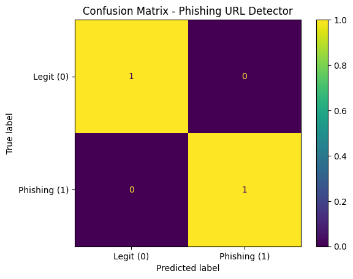

# 🔒 Phishing URL Detector (ML + Streamlit)

A machine learning project that predicts whether a URL is **phishing** or **legitimate** using engineered URL-based features such as length, subdomains, suspicious keywords, digits, and special characters.

The project includes a **Streamlit web demo** and an evaluation report with classification metrics and confusion matrix.

---

## 🚀 Features
- URL feature engineering (security-inspired heuristics)
- ML classification using Scikit-learn
- Streamlit web app demo with phishing probability score
- Model explainability using feature contribution table
- Evaluation reports (classification report + confusion matrix)

---

## 🖼️ Demo / Screenshots

### Confusion Matrix


---

## 🛠️ Tech Stack
- Python
- Pandas, NumPy
- Scikit-learn
- Streamlit
- Matplotlib
- Joblib

---

## ▶️ Run Locally

### 1) Create virtual environment
```bash
python -m venv .venv
2) Activate environment
Windows

bash
Copy code
.venv\Scripts\activate
Mac/Linux

bash
Copy code
source .venv/bin/activate
3) Install dependencies
bash
Copy code
pip install -r requirements.txt
4) Train the model
bash
Copy code
python -m src.train
5) Run evaluation
bash
Copy code
python -m src.evaluate
6) Start the Streamlit app
bash
Copy code
streamlit run app/streamlit_app.py
📌 Project Structure
text
Copy code
app/        # Streamlit web app
src/        # feature engineering + training + evaluation
data/raw/   # dataset (urls.csv)
models/     # saved model artifacts
reports/    # evaluation outputs

